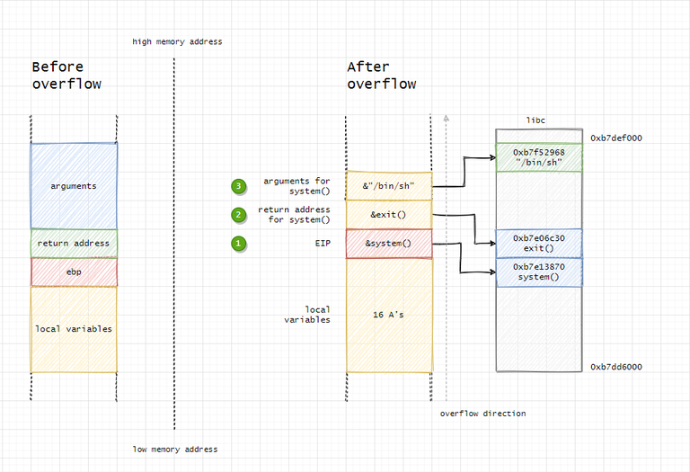

# Walkthrough - level05

The program has SUID permissions from the user `level05`, which will allow us to obtain their flag.

# Dissassembly

- Presence d'un fork qui execute un `gets` pour le mettre dans une variable s
- Pas de possibilite d'executer un shellcode car le fork ne nous laisse pas la main sur le stdin
- Le parent commence par wait son child et le kill en cas de probleme durant son execution

# Exploit

L'idee ici est de reecrire l'EIP du main dans le child afin qu'elle execute la fonction `system` de la libc. Pour cela on doit suivre le schema suivant :



Il nous faut donc trouver les addresses des fonctions `system` et `exit` dans la libc.

Pour cela, dans gdb :
```bash
(gdb) b main
(gdb) run
(gdb) p system
$1 = {<text variable, no debug info>} 0xf7e6aed0 <system>
(gdb) p exit
$2 = {<text variable, no debug info>} 0xf7e5eb70 <exit>
```

On doit egalement trouver la valeur de l'offset pour reecrire l'EIP. Le buffer overflow pattern generator nous donne `156`.

Il nous reste a stocker la commande dans les variables d'environnement et recuperer son addresse. Pour cela, il ne faut pas oublier d'unset les variables `COLUMNS` et `LINES` de gdb. On peut ensuite recuperer les addresses :
```bash
(gdb) unset env LINES
(gdb) unset env COLUMNS
(gdb) b main
(gdb) run
(gdb) x/500s
```

On recupere ainsi l'addresse de notre variable d'environnement (attention, le nom de la variable est egalement stocke a cet endroit, il faut bine recuperer l'addresse de la valeur de la variable d'environnement).

Source des explications de read_to_libc : https://www.ired.team/offensive-security/code-injection-process-injection/binary-exploitation/return-to-libc-ret2libc#finding-system